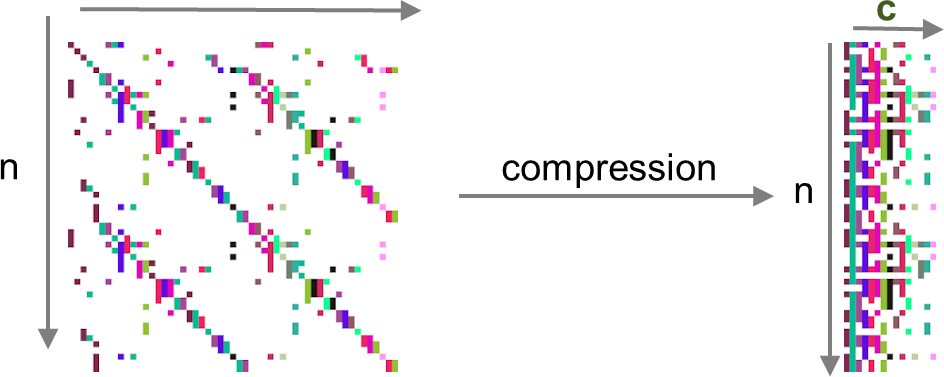

```@meta
CurrentModule = ExaPF
DocTestSetup = quote
    using ExaPF
    const AD = ExaPF.AD
end
DocTestFilters = [r"ExaPF"]
```

# AutoDiff

## Overview

Given a set of equations `F(x) = 0`, the Newton-Raphson algorithm for
solving nonlinear equations (see below) requires the Jacobian `J = jacobian(x)`
of `F`. At each iteration a new step `dx` is computed by
solving a linear system. In our case `J` is sparse and indefinite.

```julia
    go = true
    while(go)
        dx .= jacobian(x)\f(x)
        x  .= x .- dx
        go = norm(f(x)) < tol ? true : false
    end
```
There are two modes of differentiation called *forward/tangent* or
*reverse/adjoint*. The latter is known in machine learning as
*backpropagation*. The forward mode generates Jacobian-vector product code
`tgt(x,d) = J(x) * d`, while the adjoint mode generates code for the
transposed Jacobian-vector product `adj(x,y) = (J(x)'*y)`. We recommend
the book *Evaluating derivatives: principles and techniques of algorithmic
differentiation* by Griewank and Walther[^1] for a more in-depth introduction to automatic
differentiation. The computational complexity of both models favors the
adjoint mode if the number of outputs of `F` is much smaller than the
number of inputs `size(x) >> size(F)`, like for example the loss functions
in machine learning. However, in our case `F` is a multivariate vector
function from $\mathbb{R}^n$ to $\mathbb{R}^n$, where $n$ is the number of
buses.



To avoid a complexity of $\mathcal{O}(n) \cdot cost(F)$ by letting the tangent mode
run over all Cartesian basis vectors of $\mathbb{R}^n$, we apply the technique of Jacobian
coloring to compress the sparse Jacobian `J`. Running the tangent mode, it
allows to compute columns of the Jacobian concurrently, by combining
independent columns in one Jacobian-vector evaluation (see
in figure above). For sparsity detection we rely on the greedy
algorithm implemented by [`SparseDiffTools.jl`](https://github.com/JuliaDiff/SparseDiffTools.jl).

Given the sparsity pattern, the forward model is applied through the package
[`ForwardDiff.jl`](https://github.com/exanauts/ForwardDiff.jl). Given the number of Jacobian
colors $c$ we can build our dual type `t1s` with `c` directions:

```julia
t1s{N} = ForwardDiff.Dual{Nothing,Float64, N} where N}
```
Note that a second-order type `t2s` can be created naturally by applying the same logic to `t1s`:

```julia
t2s{M,N} =  ForwardDiff.Dual{Nothing,t1s{N}, M} where M, N}
```

Finally, this dual type can be ported to both vector types `Vector` and `CuVector`:

```julia
VT = Vector{Float64}
VT = Vector{t1s{N}}}
VT = CuVector{t1s{N}}}
```

Setting `VT` to either of the three types allows us to instantiate code that has been written using the *broadcast operator* `.`

```julia
x .= a .* b
```

or accessed in kernels written for `KernelAbstractions.jl` like for example the power flow equations (here in polar form):

```julia
@kernel function residual_kernel!(F, v_m, v_a,
                                  ybus_re_nzval, ybus_re_colptr, ybus_re_rowval,
                                  ybus_im_nzval, ybus_im_colptr, ybus_im_rowval,
                                  pinj, qinj, pv, pq, nbus)

    npv = size(pv, 1)
    npq = size(pq, 1)

    i = @index(Global, Linear)
    # REAL PV: 1:npv
    # REAL PQ: (npv+1:npv+npq)
    # IMAG PQ: (npv+npq+1:npv+2npq)
    fr = (i <= npv) ? pv[i] : pq[i - npv]
    F[i] -= pinj[fr]
    if i > npv
        F[i + npq] -= qinj[fr]
    end
    @inbounds for c in ybus_re_colptr[fr]:ybus_re_colptr[fr+1]-1
        to = ybus_re_rowval[c]
        aij = v_a[fr] - v_a[to]
        coef_cos = v_m[fr]*v_m[to]*ybus_re_nzval[c]
        coef_sin = v_m[fr]*v_m[to]*ybus_im_nzval[c]
        cos_val = cos(aij)
        sin_val = sin(aij)
        F[i] += coef_cos * cos_val + coef_sin * sin_val
        if i > npv
            F[npq + i] += coef_cos * sin_val - coef_sin * cos_val
        end
    end
end
```

These two abstractions are a powerful tool that allow us to implement the
forward mode in vectorized form where the number of directions or tangent
components of a tangent variable are the number of Jacobian colors. We
illustrate this in the figure below with a point-wise vector product `x .* y`


This natural way of computing the compressed Jacobian yields a very high
performing code that is portable to any vector architecture, given that a
similar package like [`CUDA.jl`](https://github.com/JuliaGPU/CUDA.jl) exists. We note that similar packages for the
Intel Compute Engine and AMD ROCm are in development called [`oneAPI.jl`](https://github.com/JuliaGPU/oneAPI.jl) and
[`AMDGPU.jl`](https://github.com/JuliaGPU/AMDGPU.jl), respectively. We expect our package to be portable to AMD and
Intel GPUs in the future.

[^1]:
    Griewank, Andreas, and Andrea Walther. *Evaluating derivatives: principles and techniques of algorithmic differentiation*. Society for Industrial and Applied Mathematics, 2008.
